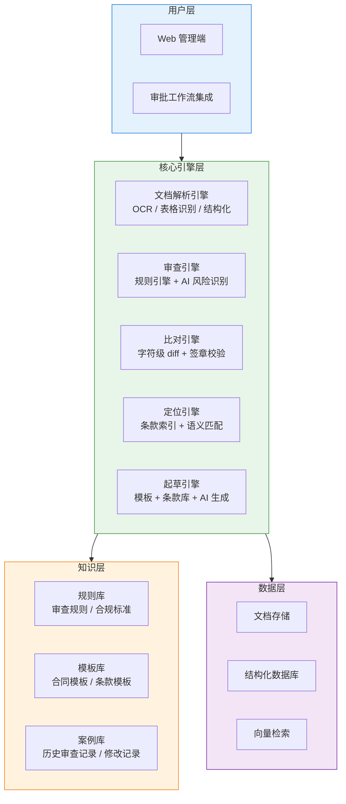
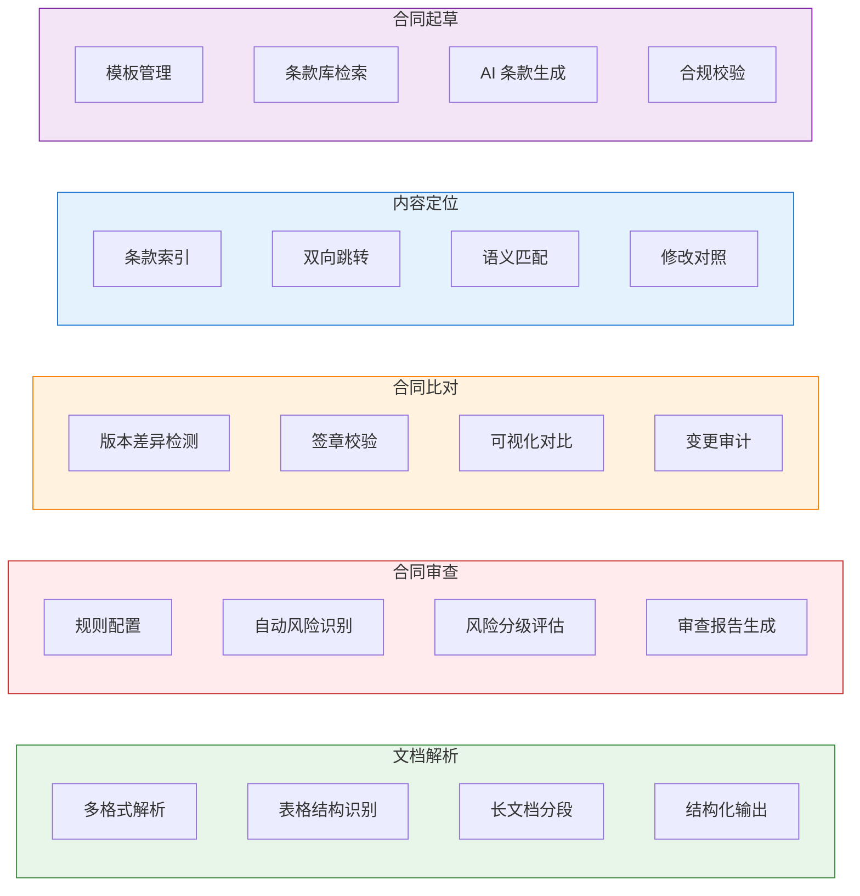
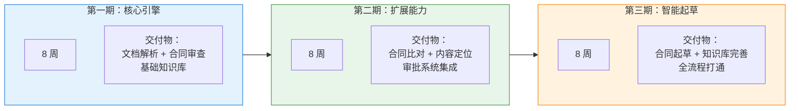

<div align="center">

# 智能合同管理平台
## 解决方案

**客户**：待确认
**版本**：V1.0
**日期**：2026-03-09

---

*本方案基于客户需求分析，经过多角度论证，为客户量身定制*

</div>

---

## 目录

- [1. 执行摘要](#1-执行摘要)
- [2. 项目背景](#2-项目背景)
- [3. 需求理解](#3-需求理解)
- [4. 解决方案](#4-解决方案)
- [5. 实施计划](#5-实施计划)
- [6. 投资与回报](#6-投资与回报)
- [7. 风险与保障](#7-风险与保障)
- [8. 为什么选择我们](#8-为什么选择我们)
- [9. 下一步行动](#9-下一步行动)
- [附录](#附录)

---

## 1. 执行摘要

> 通过 AI 文档解析、智能审查和自动化起草，将合同处理从"人工逐字审阅"变为"机器预处理 + 人工决策"，把合同审查周期从天级压缩到小时级。

### 1.1 项目概览

| 项目 | 内容 |
|------|------|
| **客户名称** | 待确认 |
| **项目名称** | 智能合同管理平台 |
| **项目类型** | 新建 |
| **核心目标** | 实现合同全生命周期的 AI 辅助管理 |
| **预计投资** | ¥100-180万（基于假设，需确认） |
| **预计周期** | 约 6 个月（分三期交付） |
| **预期 ROI** | 投资回收期 12-18 个月 |

> ⚠️ 预算和周期为基于行业经验的估算，需与客户确认实际约束。

### 1.2 核心价值

<table>
<tr>
<td width="25%" align="center">
<b>审查提效</b><br>
合同审查耗时降低 70%+，<br>释放法务团队精力
</td>
<td width="25%" align="center">
<b>风险前置</b><br>
审批前自动识别条款风险，<br>降低漏审率
</td>
<td width="25%" align="center">
<b>起草标准化</b><br>
基于知识库自动生成合规条款，<br>减少人为疏漏
</td>
<td width="25%" align="center">
<b>版本可追溯</b><br>
签署前后智能比对，<br>杜绝篡改和漏审
</td>
</tr>
</table>

### 1.3 方案亮点

| # | 亮点 | 说明 |
|---|------|------|
| 1 | **分阶段交付，快速见效** | 先上线解析 + 审查模块（最高频场景），2 个月内可用 |
| 2 | **规则引擎 + AI 双保险** | 标准审查走规则引擎保证稳定性，复杂场景走 AI 模型提升覆盖率 |
| 3 | **知识库持续积累** | 审查结果、修改历史自动沉淀为知识资产，系统越用越准 |

---

## 2. 项目背景

### 2.1 客户概况

> ⚠️ 客户档案暂缺，以下为基于需求特征的推断，需与客户确认。

从需求内容看，客户具备以下特征：
- 政企或大型企业，合同量大、类型多
- 已有合同管理流程（起草→审批→签署→归档），但以人工为主
- 法务/合规团队面临审查压力，希望通过技术手段提效

### 2.2 现状与挑战

#### 面临的挑战

| # | 挑战 | 影响 | 紧迫性 |
|---|------|------|--------|
| 1 | 合同文件格式多样（PDF/DOC/DOCX/XLS），人工解析费时 | 大量时间花在格式转换和信息提取上 | 高 |
| 2 | 合同审查依赖法务个人经验，标准不统一 | 审查质量参差不齐，存在漏审风险 | 高 |
| 3 | 不同版本合同手工比对困难 | 签署版与审批版差异难以发现，存在篡改隐患 | 中 |
| 4 | 合同起草重复劳动多，条款复用率低 | 起草效率低，条款质量不稳定 | 中 |
| 5 | 审查意见与原文脱节，来回翻找 | 审批流程耗时长，沟通成本高 | 中 |

### 2.3 项目背景

客户需要一套智能合同管理平台，覆盖合同从起草、审查、比对到归档的全流程。项目的直接驱动力是：合同量增长与法务团队人力之间的矛盾日益突出。

---

## 3. 需求理解

> 客户的核心诉求：**用 AI 能力替代合同管理中重复性高、规则性强的人工劳动，让法务团队聚焦在高价值的判断和决策上。**

### 3.1 核心需求

#### 业务需求

| # | 需求 | 优先级 | 来源 |
|---|------|--------|------|
| 1 | 合同文件解析：支持 PDF/DOC/DOCX/XLSX/XLS 格式，具备长文档和复杂表格解析能力 | P0 必须 | 客户明确提出 |
| 2 | 智能合同审查：自动识别合同风险，支持灵活配置审查规则，输出风险评估和建议 | P0 必须 | 客户明确提出 |
| 3 | 智能合同比对：不同版本逐字比对，包括段落、标点、表格、签章差异 | P1 重要 | 客户明确提出 |
| 4 | 内容智能定位：条款识别定位，审查意见与原文双向跳转，内容匹配召回 | P1 重要 | 客户明确提出 |
| 5 | 智能合同起草：结合知识库、模板库、条款库，用户输入关键词即可生成合规条款 | P1 重要 | 客户明确提出 |

#### 技术需求

| # | 需求 | 说明 |
|---|------|------|
| 1 | 文档结构化输出 | 支持 Markdown 格式或其他结构化格式输出 |
| 2 | 表格识别 | 支持有线表、无线表、彩色背景表格的结构化解析 |
| 3 | 签章校验 | 签署阶段能识别和校验印章 |
| 4 | 规则可配置 | 审查规则支持企业自定义，满足不同业务线需求 |

### 3.2 约束条件

> ⚠️ 以下为基于假设的预估，需与客户确认。

| 约束类型 | 具体要求 | 备注 |
|----------|----------|------|
| **预算** | 待确认 | 需了解客户预算区间 |
| **时间** | 待确认 | 建议分期交付，首期 2 个月 |
| **技术** | 待确认 | 需了解现有 IT 基础设施和集成要求 |
| **资源** | 待确认 | 需了解客户方配合资源 |

### 3.3 成功标准

| # | 标准 | 当前值 | 目标值 | 衡量方式 |
|---|------|--------|--------|----------|
| 1 | 合同审查平均耗时 | 人工审查 2-4 小时/份（假设） | 30 分钟内完成预审 | 统计平均审查时长 |
| 2 | 风险识别覆盖率 | 依赖个人经验（假设） | ≥90% 已知风险类型覆盖 | 对比人工审查结果 |
| 3 | 文档解析准确率 | 不适用 | 文本 ≥95%，表格 ≥90% | 抽样校验 |
| 4 | 版本比对遗漏率 | 人工比对存在遗漏（假设） | ≤1% | 对比全量 diff 结果 |

---

## 4. 解决方案

### 4.1 方案概述

#### 整体思路

方案采用"规则引擎 + AI 模型"双引擎架构。标准化、规则明确的审查项（如必备条款检查、金额校验）走规则引擎，保证稳定性和可解释性；复杂语义分析（如风险条款识别、条款生成）走 AI 模型，提升覆盖面。

实施上采取分阶段策略：先落地文档解析和合同审查（使用频率最高、价值最直接），再扩展比对和定位能力，最后上线起草模块。这个顺序的考量是——起草模块对知识库的依赖最重，而知识库在前两期的使用过程中会自然积累。

#### 方案架构图



### 4.2 功能设计

#### 功能全景



#### 核心功能详解

**模块 1：合同文件解析**

| 功能 | 说明 | 价值 |
|------|------|------|
| 多格式解析 | 支持 PDF、DOC、DOCX、XLSX、XLS 五种格式 | 覆盖企业常见合同文件类型 |
| 长文档解析 | 对上百页合同进行分段处理，不丢失上下文 | 解决大型框架协议的解析难题 |
| 表格识别 | 支持有线表、无线表、彩色背景表格，识别单元格空间位置关系并构建矩阵 | 合同中的价格表、条款对照表等可被准确提取 |
| 结构化输出 | 输出 Markdown 格式或结构化 JSON | 下游模块可直接消费，无需二次处理 |

**模块 2：智能合同审查**

| 功能 | 说明 | 价值 |
|------|------|------|
| 审查规则配置 | 企业可自定义审查规则集，按业务线/合同类型分别配置 | 适应不同部门、不同合同类型的审查标准 |
| 自动风险识别 | AI 模型扫描合同全文，标记风险条款和缺失条款 | 替代人工逐条核对，大幅缩短审查时间 |
| 风险分级 | 按严重程度对风险点分级（高/中/低），并给出修改建议 | 法务可优先处理高风险项，提升审查效率 |
| 审查报告 | 自动生成结构化审查报告，包含风险列表和修改建议 | 审查结果可存档、可追溯、可比较 |

**模块 3：智能合同比对**

| 功能 | 说明 | 价值 |
|------|------|------|
| 版本差异检测 | 段落文本、标点符号、表格内容、签章逐项比对 | 发现肉眼难以察觉的细微修改 |
| 签章校验 | 签署版与归档版的印章位置、内容校验 | 防止签署后文件被替换 |
| 可视化比对 | 并排显示差异，用颜色标注新增/删除/修改 | 直观呈现变更点，降低理解成本 |
| 变更审计 | 记录每次比对结果，形成完整的变更历史 | 满足合规审计要求 |

**模块 4：内容智能定位**

| 功能 | 说明 | 价值 |
|------|------|------|
| 条款识别定位 | 自动识别合同条款结构，建立条款索引 | 快速定位到特定条款，无需手动翻页 |
| 双向跳转 | 审查意见与原文位置双向关联，点击即可跳转 | 审批人可一键查看问题条款的原文上下文 |
| 语义匹配召回 | 输入关键词或语义描述，匹配相关条款内容 | 查找特定类型条款（如违约金、保密条款）时效率提升数倍 |
| 修改对照 | 原文与修改后内容并排展示 | 审批人可快速确认修改是否合理 |

**模块 5：智能合同起草**

| 功能 | 说明 | 价值 |
|------|------|------|
| 模板管理 | 管理企业内部合同模板库，支持分类和版本控制 | 确保使用最新合规模板 |
| 条款库检索 | 结合知识库中的标准条款、法规要求，按场景推荐 | 避免遗漏必备条款 |
| AI 条款生成 | 输入关键词和业务场景，自动生成符合要求的条款 | 大幅降低起草门槛，非法务人员也能拟稿 |
| 合规预检 | 起草过程中实时校验条款是否符合企业内外部规范 | 问题在起草阶段就被拦截，减少后续审查轮次 |

### 4.3 技术方案

#### 技术架构

| 层次 | 技术选型 | 说明 |
|------|----------|------|
| 文档处理 | OCR 引擎 + 版式分析 | 多格式文件解析，表格结构识别 |
| NLP / AI | 大语言模型 + 微调 | 风险识别、条款理解、条款生成 |
| 规则引擎 | 可配置规则框架 | 标准审查项、合规检查、模板匹配 |
| 检索 | 向量数据库 + 全文索引 | 条款语义检索、知识库匹配 |
| 比对 | 字符级 diff 算法 | 精确到标点符号的差异检测 |
| 存储 | 对象存储 + 关系数据库 | 原始文件存储、结构化数据存储 |
| 部署 | 私有化部署（建议） | 合同数据敏感，建议本地或专有云部署 |

#### 技术亮点

- **规则 + AI 双引擎**：标准检查走规则保证 100% 覆盖和可解释性，复杂分析走 AI 模型扩展能力边界。两者结果合并输出，互为补充。
- **知识库自增长**：审查过程中法务的修改和标注会自动沉淀到知识库，系统的准确率随使用时间逐步提升。

### 4.4 集成方案

| 集成系统 | 集成方式 | 数据流向 | 说明 |
|----------|----------|----------|------|
| OA / 审批系统 | API | 双向 | 审查结果推送到审批流，审批意见回传 |
| 文档管理 / 归档系统 | API | 输出 | 合同终版自动归档 |
| ERP / 财务系统 | API | 输入 | 获取合同关联的业务数据（金额、供应商等） |

> ⚠️ 具体集成范围需根据客户现有系统确认。

---

## 5. 实施计划

### 5.1 项目阶段



### 5.2 详细计划

#### 第一期：核心引擎（第 1-8 周）

| 任务 | 负责方 | 交付物 | 里程碑 |
|------|--------|--------|--------|
| 需求细化和确认 | 双方 | 需求规格书 | - |
| 文档解析引擎开发 | 我方 | 多格式解析能力 | - |
| 表格识别模块开发 | 我方 | 表格结构化输出 | - |
| 审查规则引擎开发 | 我方 | 可配置规则框架 | - |
| AI 风险识别模型训练 | 我方 | 风险识别模型 | - |
| 基础知识库搭建 | 双方 | 初始规则库和模板库 | - |
| 集成测试和验收 | 双方 | 测试报告 | M1：核心引擎上线 |

#### 第二期：扩展能力（第 9-16 周）

| 任务 | 负责方 | 交付物 | 里程碑 |
|------|--------|--------|--------|
| 版本比对引擎开发 | 我方 | 字符级 diff 能力 | - |
| 签章校验模块 | 我方 | 签章识别和校验 | - |
| 条款索引和定位 | 我方 | 双向跳转能力 | - |
| 语义匹配召回 | 我方 | 条款检索能力 | - |
| OA/审批系统集成 | 双方 | 审批流集成 | - |
| 知识库扩充 | 双方 | 扩展规则和案例 | M2：全功能上线 |

#### 第三期：智能起草（第 17-24 周）

| 任务 | 负责方 | 交付物 | 里程碑 |
|------|--------|--------|--------|
| 模板库管理模块 | 我方 | 模板管理功能 | - |
| 条款库和条款推荐 | 我方 | 条款检索和推荐 | - |
| AI 条款生成 | 我方 | 关键词驱动的条款生成 | - |
| 合规预检模块 | 我方 | 起草阶段合规校验 | - |
| 全流程联调 | 双方 | 端到端测试 | - |
| 用户培训 | 我方 | 培训文档和培训 | M3：全平台交付 |

### 5.3 里程碑

| # | 里程碑 | 时间 | 验收标准 |
|---|--------|------|----------|
| M1 | 核心引擎上线 | 第 8 周 | 文档解析准确率 ≥95%，审查覆盖已配置规则 100% |
| M2 | 全功能上线 | 第 16 周 | 比对能力覆盖段落/标点/表格/签章，定位跳转可用 |
| M3 | 全平台交付 | 第 24 周 | 起草模块可用，全流程贯通，用户完成培训 |

### 5.4 项目团队

#### 我方团队

| 角色 | 职责 | 投入 |
|------|------|------|
| 项目经理 | 整体协调、进度管控、风险管理 | 1 人，全程 |
| 产品经理 | 需求细化、原型设计、验收标准 | 1 人，全程 |
| AI 工程师 | 模型训练、NLP 开发、效果调优 | 2 人，全程 |
| 后端工程师 | 引擎开发、API 接口、系统集成 | 2 人，全程 |
| 前端工程师 | 交互界面、可视化组件 | 1 人，全程 |
| 测试工程师 | 功能测试、性能测试、验收支持 | 1 人，二/三期 |

#### 客户方配合

| 角色 | 职责 | 投入要求 |
|------|------|----------|
| 项目对接人 | 需求确认、验收签字、内部协调 | 固定 1 人 |
| 法务专家 | 提供审查规则、标注训练数据、验证审查结果 | 第一期每周 2-3 天 |
| IT 对接人 | 系统集成、部署环境、权限配置 | 按需 |

---

## 6. 投资与回报

### 6.1 投资概算

> ⚠️ 以下为基于项目规模的预估，最终报价需在需求确认后给出。

#### 费用明细

| 费用项 | 金额 | 说明 |
|--------|------|------|
| 第一期（解析 + 审查） | ¥40-60万 | 文档解析引擎、审查引擎、基础知识库 |
| 第二期（比对 + 定位） | ¥30-50万 | 比对引擎、定位引擎、系统集成 |
| 第三期（起草） | ¥30-50万 | 起草引擎、知识库完善、全流程联调 |
| 基础设施（如需） | ¥10-20万 | GPU 服务器、存储（私有化部署场景） |
| 年度维护 | ¥15-25万/年 | 模型更新、规则维护、技术支持 |
| **合计** | **¥100-180万** | 首年总投入 |

#### 付款方式

| 节点 | 比例 | 条件 |
|------|------|------|
| 合同签订 | 30% | 合同生效 |
| M1 核心引擎验收 | 30% | 文档解析 + 审查通过验收 |
| M2 全功能验收 | 20% | 比对 + 定位通过验收 |
| M3 终验 | 20% | 全平台交付验收 |

### 6.2 投资回报分析

#### 可量化收益

| 收益项 | 计算方式 | 年度收益 |
|--------|----------|----------|
| 审查人力节省 | 假设 5 名法务，每人每天审查 3 份合同，效率提升 70% → 等效释放 3.5 人力 | ¥70-100万/年 |
| 风险损失降低 | 假设每年因合同漏审导致的损失占合同总额 0.1%，降低 80% | 视合同总额而定 |
| 起草效率提升 | 假设起草耗时降低 50%，覆盖全公司合同拟稿 | ¥15-30万/年 |

#### ROI 分析

```
投资总额：¥100-180万（取中间值 ¥140万）
年度直接收益：¥85-130万（取中间值 ¥107万）
投资回收期：约 16 个月

ROI = (107 - 140 × 15%) / 140 × 100% ≈ 61%（第二年起）
```

#### 难以量化但同样重要的收益

- **合规风险降低**：自动审查和比对减少合同纠纷发生概率
- **组织知识沉淀**：法务经验从个人能力变为组织资产
- **审批流程加速**：合同从起草到签署的整体周期缩短

---

## 7. 风险与保障

### 7.1 风险识别与应对

| # | 风险 | 概率 | 影响 | 应对措施 |
|---|------|------|------|----------|
| 1 | AI 模型准确率不达标 | 中 | 高 | 规则引擎兜底保障基线准确率；第一期用真实数据验证模型效果，达标后再进入第二期 |
| 2 | 知识库冷启动内容不足 | 中 | 中 | 第一期安排法务专家集中标注，同时接入公开法规库作为补充 |
| 3 | 复杂表格识别精度不足 | 中 | 中 | 对识别置信度低的表格标记为"需人工复核"，不做静默处理 |
| 4 | 与现有系统集成难度超预期 | 低 | 高 | 第一期先独立运行验证核心功能，集成放到第二期，留出调研时间 |
| 5 | 客户法务专家投入不足 | 中 | 高 | 合同中明确客户方配合条款和投入时间要求 |

### 7.2 质量保障

| 保障措施 | 说明 |
|----------|------|
| **需求确认** | 每期开始前完成书面需求确认，变更走正式流程 |
| **效果验证** | 每个模块上线前用客户真实合同数据做测试，达标才交付 |
| **渐进交付** | 分三期交付，每期结束有独立验收节点，问题及早暴露 |
| **人工兜底** | 对 AI 不确定的结果标记置信度，低于阈值的交由人工复核 |

### 7.3 服务承诺

| 服务项 | 承诺 |
|--------|------|
| 问题响应 | 工作日 4 小时内响应，严重问题 2 小时 |
| 问题修复 | 一般问题 3 个工作日，严重问题 1 个工作日 |
| 模型更新 | 每季度根据使用反馈迭代模型 |
| 数据安全 | 合同数据不出客户环境，AI 模型本地部署 |

---

## 8. 为什么选择我们

### 8.1 我们的优势

<table>
<tr>
<td width="33%" align="center">
<b>AI + 行业理解</b><br>
具备 NLP、文档处理、规则引擎的完整技术栈，同时理解合同管理的业务场景
</td>
<td width="33%" align="center">
<b>务实的交付策略</b><br>
不搞一步到位，分三期交付，每期都有可用的产出，降低项目风险
</td>
<td width="33%" align="center">
<b>持续陪跑</b><br>
知识库和模型需要持续优化，我们提供长期运维和迭代服务
</td>
</tr>
</table>

### 8.2 相关能力

| 能力领域 | 说明 |
|----------|------|
| 文档智能处理 | 多格式解析、OCR、表格识别、版式分析 |
| NLP / 大模型应用 | 文本理解、信息抽取、风险识别、文本生成 |
| 规则引擎 | 可配置规则框架，支持企业自定义审查逻辑 |
| 企业系统集成 | OA、ERP、文档管理系统的 API 集成经验 |

---

## 9. 下一步行动

### 9.1 建议行动

| # | 行动 | 负责方 | 建议时间 |
|---|------|--------|------|
| 1 | 方案沟通和答疑 | 双方 | 本周 |
| 2 | 客户提供 5-10 份典型合同样本用于测试 | 客户方 | 方案确认后 1 周内 |
| 3 | 基于样本的效果验证（POC） | 我方 | 拿到样本后 2 周 |
| 4 | 报价和合同签订 | 双方 | POC 通过后 |
| 5 | 项目启动 | 双方 | 合同签订后 1 周 |

### 9.2 需要客户确认的信息

| # | 待确认项 | 说明 |
|---|----------|------|
| 1 | 预算范围 | 便于调整方案范围和分期策略 |
| 2 | 时间要求 | 是否有硬性上线截止时间 |
| 3 | 合同类型和数量 | 年处理合同量，主要合同类型 |
| 4 | 现有系统 | 在用的 OA、审批、归档系统是什么 |
| 5 | 部署要求 | 私有化部署还是可接受云服务 |
| 6 | 对接人 | 法务对接人和 IT 对接人 |

---

## 附录

### 附录 A：术语表

| 术语 | 说明 |
|------|------|
| OCR | Optical Character Recognition，光学字符识别，用于从图片/扫描件中提取文字 |
| NLP | Natural Language Processing，自然语言处理，用于理解和生成文本 |
| 规则引擎 | 基于预定义规则进行自动判断的系统，结果确定且可解释 |
| 向量检索 | 基于语义相似度的检索方式，用于条款匹配和知识库查询 |
| Diff | 文本差异检测算法，用于发现两个版本之间的具体变更 |
| POC | Proof of Concept，概念验证，用真实数据验证方案可行性 |

### 附录 B：A/B 方案评审记录

#### 方案 A（建设者视角）要点

- 5 个模块完整覆盖合同全生命周期
- 规则引擎 + AI 双引擎确保准确率和覆盖率
- 统一平台避免模块间数据割裂
- 6 个月完成全部功能交付

#### 方案 B（批判者视角）提出的质疑

1. **范围过大**：5 个模块同时铺开，资源分散。建议分出优先级，先做高价值模块。
2. **AI 准确率风险**：合同审查涉及法律风险，AI 误判的后果比一般场景严重。需要有人工兜底机制。
3. **知识库冷启动**：起草模块依赖大量的模板和条款数据，但一开始这些数据并不存在。如果起草模块和核心引擎同期开发，知识库可能跟不上。
4. **成本可能低估**：模型训练需要标注数据（法务专家的时间），这是一笔隐性成本。
5. **替代建议**：分三期实施，第一期只做解析 + 审查，先验证 AI 能力再扩展。

#### 专家评委综合意见

采纳 A 方案的整体架构设计和双引擎思路，同时采纳 B 方案的分期策略和风险预判。最终方案做了以下调整：

- 将 5 模块拆分为 3 期交付，按价值优先级排序
- 第一期结束设置"效果验证关"，AI 达标才进入第二期
- 知识库建设作为贯穿全程的并行工作流
- 所有 AI 输出附带置信度，低于阈值必须人工复核

---

<div align="center">

**感谢您的信任，期待与您合作！**

楔子科技

</div>
